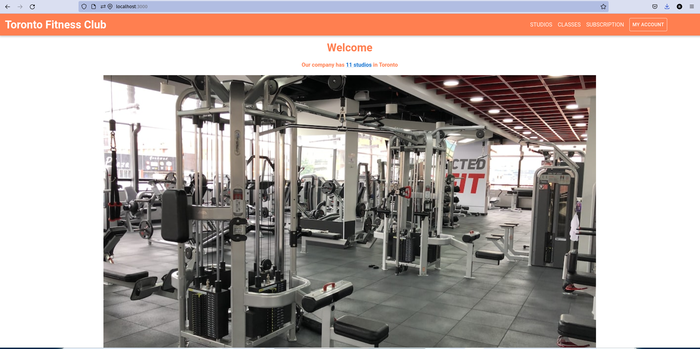
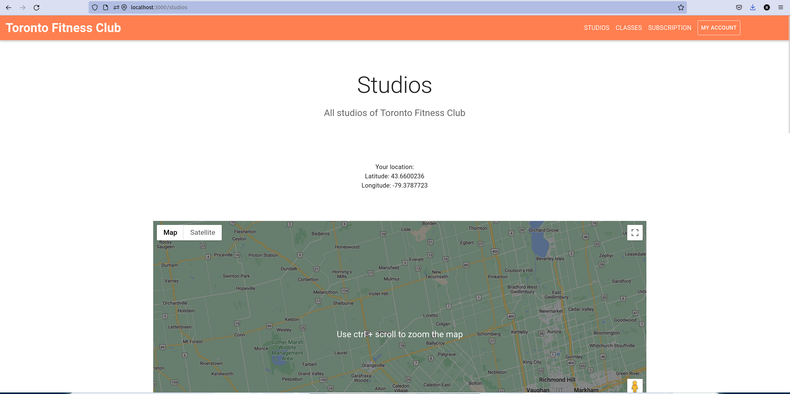
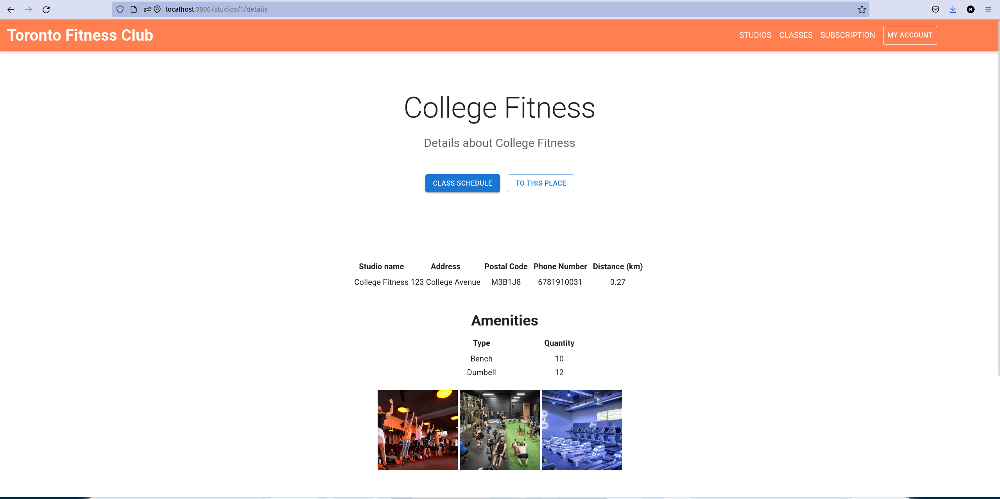
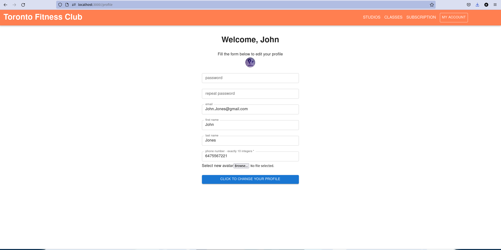
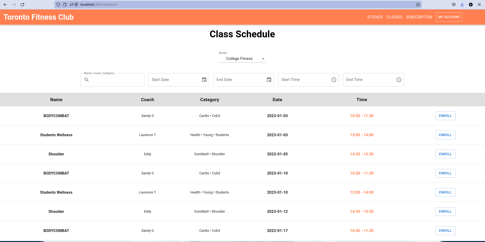
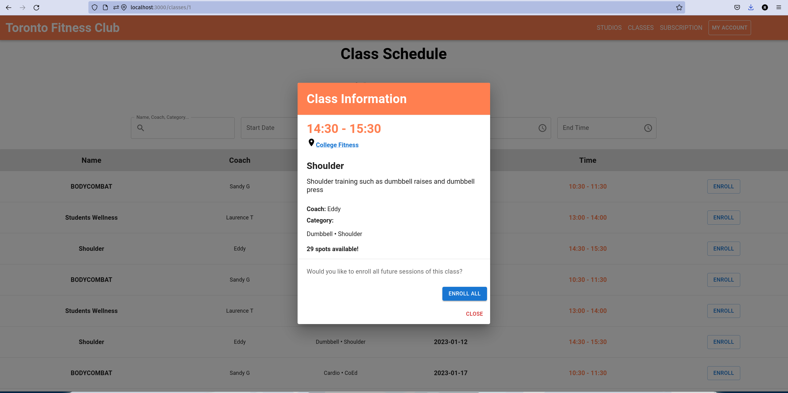
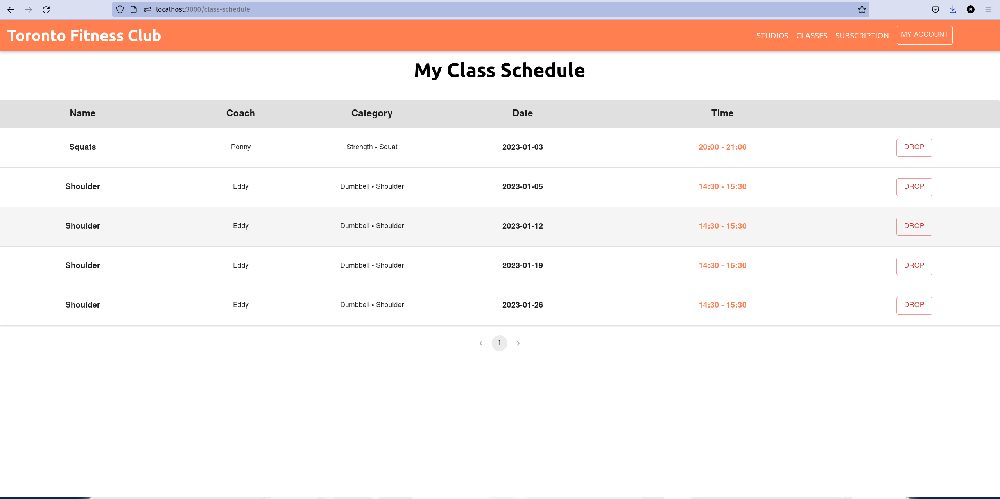
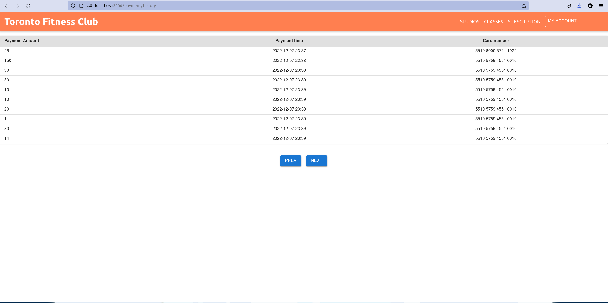
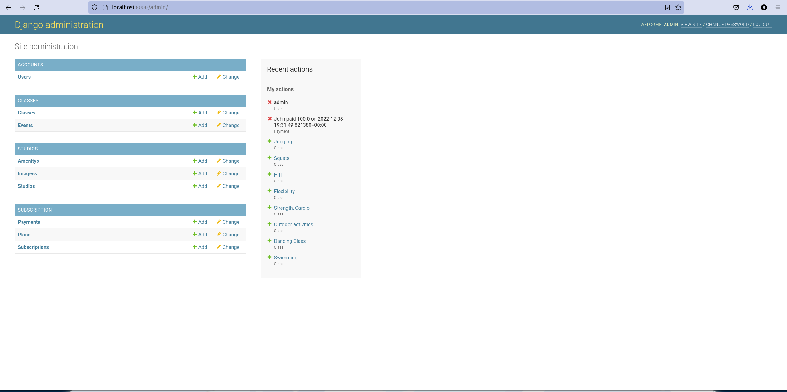

# Toronto Fitness Club Website
Requirements: Python3, pip, virtualenv and npm installed.


To install all other requirements run

```
source startup.sh
```
in the PF folder.


To start the website run 

```
source run.sh
```
in the PF folder.

The website can be accessed at localhost:3000, the admin panel can be accessed at localhost:8000. The admin account is Admin:1111, the dummy user account is John:1111

Some screenshots from the website:










